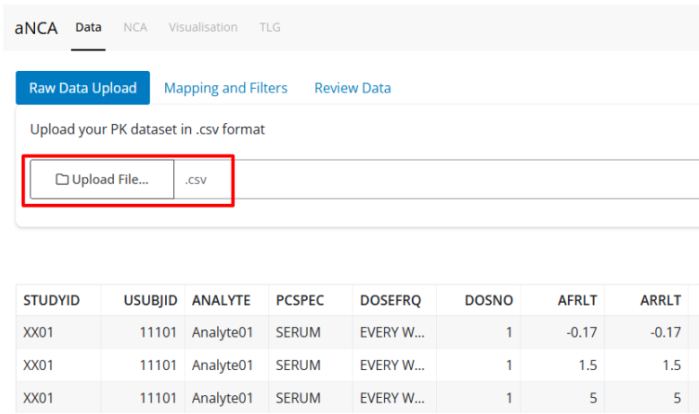
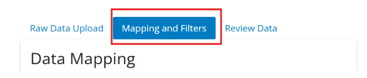
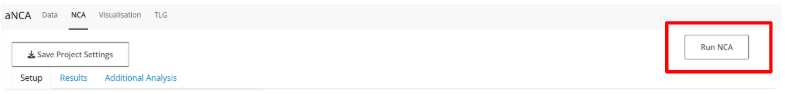
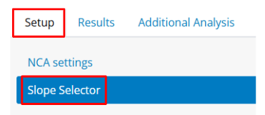
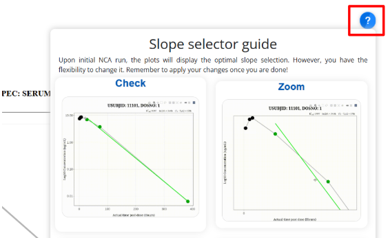
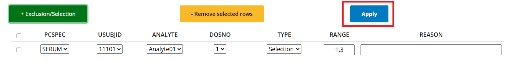
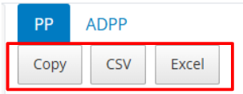
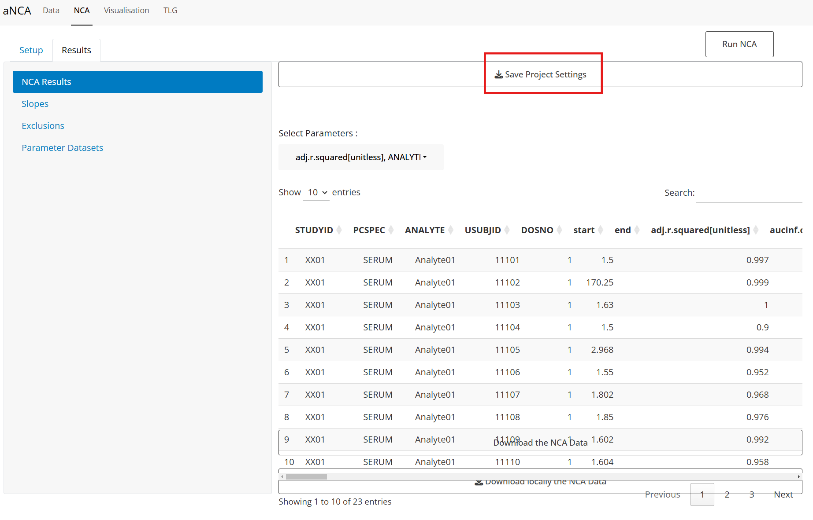
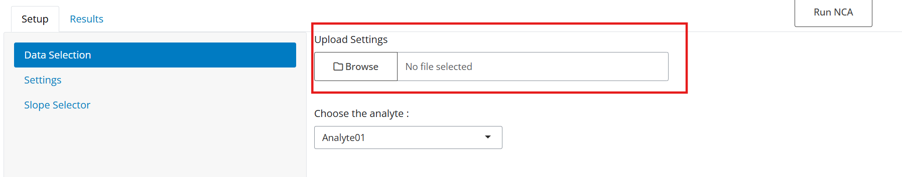

This guide will provide users with information on how to get started with the aNCA app.

# Step 1: Prepare Dataset

### Uploading a dataset

Click *Upload File* and select the dataset you would like to use. The data must be in `.csv` or `.rds` format. The best input for the app is data that follows the ADNCA format. Other formats of data will also work. Alternatively, for exploring the app, Users can use the Dummy dataset that is already uploaded.

### Data format

|   | **Variable** | **Description** | **Format** |
|------------------|------------------|-------------------|------------------|
|  | STUDYID | Study Identifier | character |
| **Grouping Identifiers** | USUBJID | Unique Subject Identifier | character/numeric |
|  | TRT01A | Treatment Group Identifier (Actual) | character |
|  | TRT01P | Treatment Group Identifier (Planned) | character |
|  | AGE | Age of Subject | numeric |
|  | RACE | Race of Subject | character |
|  | SEX | Sex of Subject | character |
| **Sample variables** | ANALYTE | Analyte | character |
|  | PCSPEC | Specimen Material Type | character |
|  | AVAL | Analysis Value | numeric |
| **Dose Variables** | DOSNO | Dose Number | numeric |
|  | ROUTE | Route of Administration, either {intravascular} or {extravascular} | character |
|  | DOSEA | Actual Treatment Dose | numeric |
|  | ADOSEDUR | Actual Treatment Dose | numeric |
| **Time Variables** | AFRLT | Actual Relative Time from Analyte First Dose | numeric |
|  | ARRLT | Actual Relative Time from Reference Dose | numeric |
|  | NFRLT | Nominal Relative Time from Analyte First Dose | numeric |
|  | NRRLT | Nominal Relative Time from Reference Dose | numeric |
|  | AVALU | Analysis Value Unit | character |
|  | DOSEU | Treatment Dose Units | character |
|  | RRLTU | Relative Time from Reference Dose Unit | character |

### Data mapping

Once the dataset has been uploaded, you can verify that the data is as expected, and click on the *Mapping and Filters* tab.

-   Map the correct columns in your dataset to the corresponding label.

-   For Unit Variables, if your dataset has a defined column for units, select it. Otherwise, by scrolling down, you can select the units for the corresponding columns.

-   Click *Submit Mapping*. You will be automatically directed to the next tab.

 

### Verifying and adding filters

Check that the data contains all the information you were expecting and is mapped correctly. If you want to change the data by adding filters, return to the *Mapping and Filters* page, then scroll down to add filters.

<blockquote class="important">

Don’t forget to scroll down and click *Submit Filters*!

</blockquote>

# Step 2: Run NCA

Click on the *NCA* tab at the top of the screen to switch to the next section.

## Data selection

1.  *NCA settings*: Choose the Analyte, Dose Number(s) and/or Specimen(s) you would like to run the NCA on, the extrapolation method and the NCA parameters to calculate. Select additional options including partial AUCs, or rule sets to flag the data. A table summarizes the settings you have selected.

2.  Note that the *Save Project Settings*/*Upload Settings* option is not working currently.

3.  Click *Run NCA* at the top of the page and check that the data is as expected. You will automatically be redirected to the *Results* tab.

# Step 3: NCA Results

## Main Results

The *NCA Results* tab shows the individual results of the NCA. You can select which parameters you would like to view. Results in red have been flagged as *FALSE* for the rule sets selected, results in purple are flagged as *MISSING*, and results in white are not flagged.

## Exclusions and Manual Slopes

Click on the *Slopes* tab to view more detailed information about the slopes selected in the NCA. To add exclusions or manual slope selections, redirect to the *Slope Selector* tab in the *Setup* page.

There are two different ways to add exclusions/selections to the slopes.

#### Via the Buttons.

1.  For selection and exclusion, click *+ Exclusion/Selection* and input the corresponding information. RANGE refers to the data point number in the slope, which can be seen by hovering over the points in the plots below.
2.  To remove, select the sample row and click *- Remove selected rows*.

#### Via the Plots

For in-app guidance, you can click the [?]{style="border:thin solid #1f6feb;border-radius:1em;font-weight:bold;color:#1f6feb;margin:.1em .5em .1em .5em;"} button.

1.  For selection, click the first point and then the last point you want included in the slope. The plot should then update and a row should be added to the table. There you can add your reason for selection.
2.  For exclusion, double click the point you want to exclude. The plot should update along with the table.
3.  To remove, either remove via the table selection, or repeat the same action (i.e. select a new slope, double click the same point).

#### Applying the exclusions

Once the exclusions/selections have been added, click *Apply*.

You can check if they have been applied in the *Results* page, on the *Exclusions* tab.

<blockquote class="important">

If you do not click *Apply*, the manual slopes will not be added!

</blockquote>

#### Parameter datasets

In the Parameter datasets tab you can see and export the ADPP and PP datasets.

## Saving and uploading settings

<blockquote class="warning">

Currently work in progress

</blockquote>

After completing an NCA and creating manual slopes, you may want to save these for next time.

#### Saving

Click the button *Save Project Settings* on top of the tabs. This will download a .csv file.

#### Uploading

To upload settings in a later analysis, after column mapping, in *Setup*, in the *NCA Setings* tab, click *Browse*. The inclusions and exclusions will be automatically added to the data.

## Step 4: Visualization

In the *Visualisation* tab, you will find the different visualization options, including Individual Plots, Mean Plots, Descriptive Statistics, and Boxplots.

<blockquote class="warning">

Currently work in progress

</blockquote>

## Step 5: TLG

<blockquote class="warning">

Currently work in progress

</blockquote>
