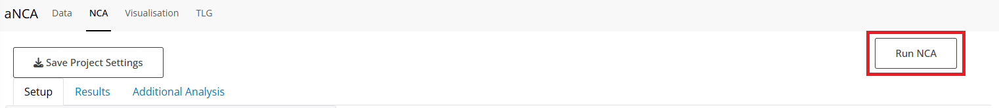
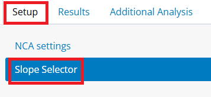
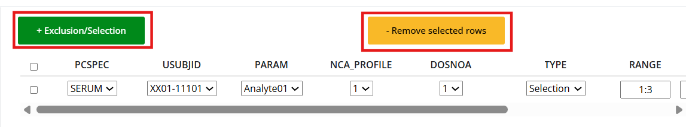

This guide will provide users with information on how to get started with the aNCA app.

# Step 1: Prepare Dataset

### Uploading a dataset

Click **Upload File** and select the dataset you would like to use. The data must be in `.csv` or `.rds` format. The best input for the app is data that follows the ADNCA format. Other formats of data will also work. Alternatively, for exploring the app, Users can use the Dummy dataset that is already uploaded.

### Data format

Some variables are mandatory (marked with \*), while others are optional. Custom variable names are supported as long as they are correctly mapped during the [Data Mapping](###%20Data%20mapping) step.

|                          | **Variable** | **Description**                                                    | **Format**        |
|------------------|------------------|-------------------|------------------|
| **Grouping Identifiers** | STUDYID \*   | Study Identifier                                                   | character         |
|                          | USUBJID \*   | Unique Subject Identifier                                          | character/numeric |
|                          | TRT01A       | Treatment Group Identifier (Actual)                                | character         |
|                          | TRT01P       | Treatment Group Identifier (Planned)                               | character         |
|                          | AGE          | Age of Subject                                                     | numeric           |
|                          | RACE         | Race of Subject                                                    | character         |
|                          | SEX          | Sex of Subject                                                     | character         |
|                          |              |                                                                    |                   |
| **Sample variables**     | PARAM \*     | Analyte studied in the sample                                      | character         |
|                          | PCSPEC \*    | Specimen Material Type                                             | character         |
|                          | AVAL \*      | Analysis Value                                                     | numeric           |
|                          |              |                                                                    |                   |
| **Dose Variables**       | DRUG \*      | Drug/Treatment compound. When relevant, should match with PARAM    | character         |
|                          | DOSNO \*     | Dose Number of administration. Used to split interval calculations | numeric           |
|                          | ROUTE \*     | Route of Administration, either {intravascular} or {extravascular} | character         |
|                          | DOSEA \*     | Actual Treatment Dose                                              | numeric           |
|                          | ADOSEDUR     | Actual Treatment Dose                                              | numeric           |
|                          |              |                                                                    |                   |
| **Time Variables**       | AFRLT \*     | Actual Relative Time from Analyte First Dose                       | numeric           |
|                          | ARRLT \*     | Actual Relative Time from Reference Dose                           | numeric           |
|                          | NFRLT \*     | Nominal Relative Time from Analyte First Dose                      | numeric           |
|                          | NRRLT \*     | Nominal Relative Time from Reference Dose                          | numeric           |
|                          |              |                                                                    |                   |
| **Time Variables**       | AVALU        | Analysis Value Unit                                                | character         |
|                          | DOSEU        | Treatment Dose Units                                               | character         |
|                          | RRLTU        | Relative Time from Reference Dose Unit                             | character         |

### Verifying and adding filters

Check that the data contains all the information you were expecting and is mapped correctly. If you want to change the data by adding filters, click the *Add Filter* button.

<blockquote class="important">

Don’t forget to scroll down and click **Submit Filters**!

</blockquote>

### Data mapping

Click on the *Column Mapping* tab.

-   Map the correct columns in your dataset to the corresponding label.

-   For Unit Variables, if your dataset has a defined column for units, select it. Otherwise, by scrolling down, you can select the units for the corresponding columns.

-   Click **Submit Mapping**. You will be automatically directed to the next tab.

 

### Review

Review the data and ensure that the columns have been mapped correctly, and all your filters have been applied. If there are any problems with your data (duplicates, missing times) you will be communicated and perhaps in certain situations your own intervention will be requested. Just follow the instructions.

# Step 2: Run NCA

Click on the *NCA* tab at the top of the screen to switch to the next section.

## Data selection

1.  *NCA settings*: Choose the Analyte, Dose Number(s) and/or Specimen(s) you would like to run the NCA on, the extrapolation method and the NCA parameters to calculate. Select additional options including partial AUCs, or rule sets to flag the data. In the summary tab, a table summarizes the settings you have selected. 

2.  Click **Run NCA** at the top of the page and check that the data is as expected. You will automatically be redirected to the *Results* tab.

<blockquote class="note">

The **Save Project Settings**/**Upload Settings** option is not working currently.

</blockquote>

# Step 3: NCA Results

## Main Results

The *NCA Results* tab shows the individual results of the NCA. You can select which parameters you would like to view. Results in red have been flagged as "FALSE" for the rule sets selected, results in purple are flagged as "MISSING", and results in white are not flagged.

## Exclusions and Manual Slopes

Click on the *Slopes* tab to view more detailed information about the slopes selected in the NCA. To add exclusions or manual slope selections, redirect to the *Slope Selector* tab in the *Setup* page.

There are two different ways to add exclusions/selections to the slopes.

#### Via the Buttons

1.  For selection and exclusion, click **+ Exclusion/Selection** and input the corresponding information. RANGE refers to the data point number in the slope, which can be seen by hovering over the points in the plots below.
2.  To remove, select the sample row and click **- Remove selected rows**.

#### Via the Plots

For in-app guidance, you can click the [?]{.help-button} button.

1.  For selection, click the first point and then the last point you want included in the slope. The plot should then update and a row should be added to the table. There you can add your reason for selection.
2.  For exclusion, double click the point you want to exclude. The plot should update along with the table.
3.  To remove, either remove via the table selection, or repeat the same action (i.e. select a new slope, double click the same point).

#### Applying the exclusions

Once the exclusions/selections have been added, click **Apply**.

You can check if they have been applied in the *Results* page, on the *Exclusions* tab.

<blockquote class="important">

If you do not click **Apply**, the manual slopes will not be added!

</blockquote>

### Parameter Datasets

In the Parameter Datasets tab you can see and export the ADPP and PP datasets.

## Additional Analysis

In the *Additional Analysis* tab, you can calculate tissue-matrix ratios using the concentration ratios tab. Input which specimen you would like as the numerator and denominator, and click **Submit**.

## Saving and uploading settings

<blockquote class="warning">

Currently work in progress

</blockquote>

After completing an NCA and creating manual slopes, you may want to save these for next time.

#### Saving

Click the button *Save Project Settings* on top of the tabs. This will download a .csv file.

#### Uploading

To upload settings in a later analysis, after column mapping, in *Setup*, in the *NCA Settings* tab, click *Browse*. The inclusions and exclusions will be automatically added to the data.

# Step 4: Visualization

In the *Visualization* tab, you will find the different visualization options, including Individual Plots, Mean Plots, Descriptive Statistics, and Boxplots.

<blockquote class="warning">

Currently work in progress

</blockquote>

# Step 5: TLGs

<blockquote class="warning">

Currently work in progress. Not all TLGs and features are available.

</blockquote>

After performing the analysis, you can prepare reports regarding the analysis, including various tables, listings and graphs.

### Order details

Firstly, you will need to prepare an order for TLGs. Table in the *Order details* tab will display some default TLGs with their metadata. You can add additional reports by clicking the **Add TLG** button. This will bring up a list of available, defined TLGs. Select the ones you are interested in and click the **Add TLGs to Order** button. You can also remove unwanted entries by selecting them and clicking **Remove TLG**.

When you are happy with the selection, click **Submit Order Details**.

### Navigating the TLGs

The application provides three separate tabs for differentiating **Tables**, **Listings** and **Graphs**.

Each tab will show a sidebar on the left of the screen. This will let you navigate each specific entry.

Using the widgets at the top you can specify the number of entries per page and change the pages.

Lastly, the widgets on the right are used for customizing the resulting reports.

### Customizing the TLGs

Exact customization options available for any given TLGs will depend on their implementation. Usually, you will be able to specify things like titles and footnotes, axis labels, limits or grouping variables.

Simply provide the desired value in a given widget and the TLG will update in real time.

Leaving a widget empty will induce default behavior of the TLG.

Some fields will provide additional functionalities. For text fields, a special syntax might be used to reference the values or attributes of the data:

-   prefacing a column name with `!` will reference the **label attribute** of a given column, e.g. `!DOSEU` will translate to `Treatment Dose Units`.
-   prefacing a column name with `$` will reference the **value** for a given column, e.g. `$DOSEU` will translate to mg (for the dummy dataset).

You can always click on the [?]{.help-button} button for help.
