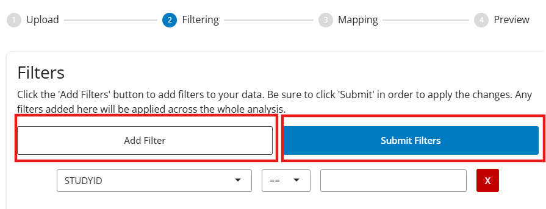
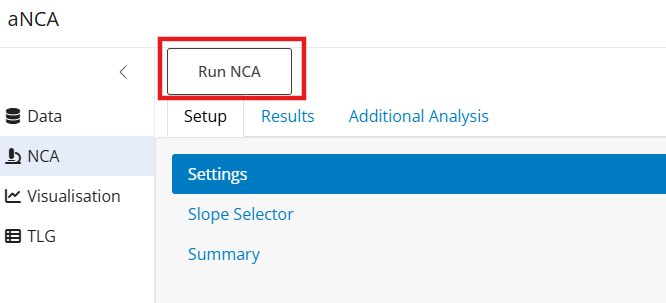
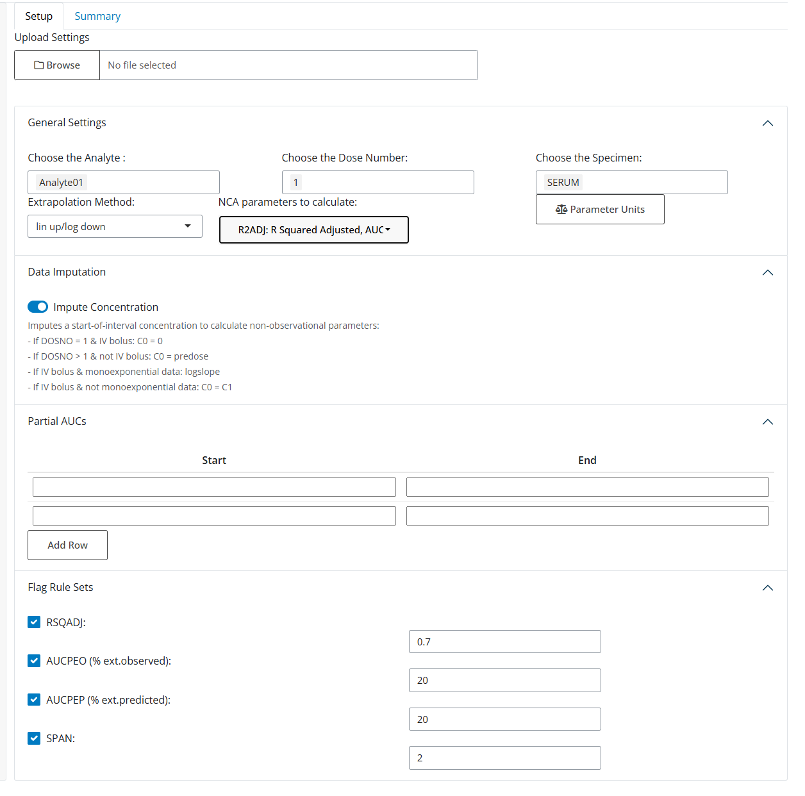
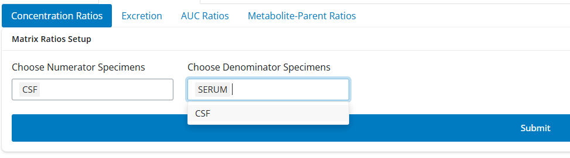

This guide will provide users with information on how to get started with the aNCA app.

# Step 1: Prepare Dataset
1. Click “Upload File” and select the dataset you would like to use. The data must be in .csv or .rds format. The best input for the app is data that follows the ADNCA format. Other formats of data will also work.

2. Once the dataset has been uploaded, you can check that the data is as expected, and then click on the “Mapping and Filters” tab. 
   - Map the correct columns in your dataset to the corresponding label. For more information on what the column requires, hover over the input boxes.
   - For Unit Variables, if your dataset has a defined column for units, select it, otherwise manually input the units for the corresponding columns.
   - Click “Submit Mapping”. You will automatically be directed to the next tab.

3. Review Data: Check that the data contains all the information you were expecting and is mapped correctly. If you want to change the data by adding filters, return to the “Mapping and Filters” page, and scroll down to add filters.

<blockquote class = "important">
Don’t forget to scroll down and click submit!
</blockquote>

# Step 2: Run NCA
Click on the “NCA” Tab at the top of the screen to switch to the next section.

1. Data Selection: Choose the analyte you would like to run the NCA on (it is currently only possible to analyse one analyte at a time).
2. Click ‘Submit” and check that the data is as expected.

Click on "Authorize" next to Sanofi-Github and follow the instructions.

<blockquote class="note">
The current version of the app only works with one matrix (PCSPEC) at a time. If you are having problems when clicking “Submit”, ensure that your data has been filtered to fit these specifications. You can return to the “Mapping and Filtering” tab in Data to do this.
</blockquote>

3. Move to “Settings” in the menu on the left hand side. Choose the Dose Number(s) you would like to run the NCA on, and the extrapolation method. Select additional options including partial AUCs, or rule sets to Flag the data.

4. Click “Run NCA”. You will automatically be redirected to the Results tab.

# Step 3: NCA Results
## 3.1. Main Results
The NCA results tab shows the individual results of the NCA. You can select which parameters you would like to view. Results in red have been flagged as “False”  for the rule sets selected, results in purple are flagged as “Missing”, and results in white are not flagged.

Click on the Slopes Tab to view more detailed information about the slopes selected in the NCA.

In Parameter datasets you can see and export the ADPP and PP datasets.

## 3.2. Exclusions and Manual Slopes
To add exclusions or manual slope selections, redirect to the Slope Selector tab in the Setup Page.
 

There are two different ways to add exclusions/selections to the slopes.

#### 3.2.1. Via the Buttons.
1. Click “+ Exclusion/Selection”
2. Input the information: Type, Patient, Profile, Range, Reason. IXrange is the Data Point number in the slope, which can be seen by hovering over the points in the plots below.

3. To remove, select the sample row and click “-Remove selected rows”

#### 3.2.2. Via the Plots
For in-app guidence, you can click the ? button.

1. For selection, click the first point and then the last point you want included in the slope. The plot should then update and a row should be added to the table. There you can add your reason for selection.
2. For exclusion, double click the point you want to exclude. The plot should update along with the table.
3. To remove, either remove via the table selection, or repeat the same action (ie select a new slope, double click the same point).

#### 3.2.3. Applying the exclusions
Once the exclusions/selections have been added, click “Apply” to apply them.

You can check if they have been applied in the Results -> Exclusions Tab.

<blockquote class="important">
If you don’t click “Apply”, the manual slopes will not be added!
</blockquote>

## 3.3. Saving Settings
After completing an NCA and creating manual slopes, you may want to save these for next time. This is very easy:
1. Click Results -> NCA Results -> Save Project Settings. This will download a .csv file.

2. To upload settings next time, after column mapping, Setup -> Data Selection -> Upload settings. The inclusions and exclusions will be automatically added to the data.

## Step 4: Visualisation
In the “Visualisation” tab, you will find the different visualisation options, including individual plots, mean plots, descriptive statistics, and boxplots.

## Step 5: TLG
<blockquote class="warning">
Currently work in progress
</blockquote>

